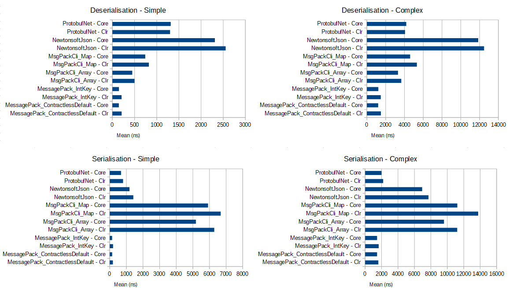

Simple benchmarks for various .Net serialisers

## Result 2019-01-25

Testing the latest current version of the following serialisers:

- [MessagePack](https://github.com/neuecc/MessagePack-CSharp) 1.7.3.4
- [MsgPack.Cli](https://github.com/msgpack/msgpack-cli) 1.0.0
  - **Note**: This is a relatively new version which appears to have a major performance regression.
    This test should really be re-run with a 0.9.x version to verify
- [Newtonsoft.Json](https://github.com/JamesNK/Newtonsoft.Json) 12.0.1
- [protobuf-net](https://github.com/mgravell/protobuf-net) 2.4.0



``` ini

BenchmarkDotNet=v0.11.3, OS=Windows 10.0.17134.523 (1803/April2018Update/Redstone4)
Intel Core i5-2500K CPU 3.30GHz (Sandy Bridge), 1 CPU, 4 logical and 4 physical cores
.NET Core SDK=2.2.103
  [Host] : .NET Core 2.2.1 (CoreCLR 4.6.27207.03, CoreFX 4.6.27207.03), 64bit RyuJIT
  Clr    : .NET Framework 4.7.2 (CLR 4.0.30319.42000), 64bit RyuJIT-v4.7.3260.0
  Core   : .NET Core 2.2.1 (CoreCLR 4.6.27207.03, CoreFX 4.6.27207.03), 64bit RyuJIT


```
|                                    Type |                          Method | Runtime |        Mean |       Error |        StdDev |      Median |
|---------------------------------------- |-------------------------------- |-------- |------------:|------------:|--------------:|------------:|
|    SerialisationBenchmark&lt;SimpleObject&gt; |                     ProtobufNet |  Clr |    801.9 ns |   1.7477 ns |     1.6348 ns |    802.2 ns |
|    SerialisationBenchmark&lt;SimpleObject&gt; |                     ProtobufNet | Core |    678.2 ns |   2.1492 ns |     2.0104 ns |    677.7 ns |
|    SerialisationBenchmark&lt;SimpleObject&gt; |                  MsgPackCli_Map |  Clr |  6,676.6 ns | 132.7600 ns |   258.9383 ns |  6,600.0 ns |
|    SerialisationBenchmark&lt;SimpleObject&gt; |                  MsgPackCli_Map | Core |  5,912.7 ns | 119.1379 ns |   292.2472 ns |  5,800.0 ns |
|    SerialisationBenchmark&lt;SimpleObject&gt; |                  NewtonsoftJson |  Clr |  1,417.9 ns |   7.7799 ns |     6.8967 ns |  1,418.1 ns |
|    SerialisationBenchmark&lt;SimpleObject&gt; |                  NewtonsoftJson | Core |  1,189.8 ns |   2.9853 ns |     2.7925 ns |  1,188.6 ns |
|    SerialisationBenchmark&lt;SimpleObject&gt; |                MsgPackCli_Array |  Clr |  6,287.5 ns | 124.7920 ns |   289.2245 ns |  6,200.0 ns |
|    SerialisationBenchmark&lt;SimpleObject&gt; |                MsgPackCli_Array | Core |  5,180.6 ns | 101.9948 ns |   170.4103 ns |  5,200.0 ns |
|    SerialisationBenchmark&lt;SimpleObject&gt; |              MessagePack_IntKey |  Clr |    197.5 ns |   1.0957 ns |     0.9149 ns |    197.2 ns |
|    SerialisationBenchmark&lt;SimpleObject&gt; |              MessagePack_IntKey | Core |    141.7 ns |   0.7756 ns |     0.7255 ns |    141.5 ns |
|    SerialisationBenchmark&lt;SimpleObject&gt; | MessagePack_ContractlessDefault |  Clr |    188.1 ns |   0.2602 ns |     0.2434 ns |    188.0 ns |
|    SerialisationBenchmark&lt;SimpleObject&gt; | MessagePack_ContractlessDefault | Core |    147.1 ns |   0.4185 ns |     0.3710 ns |    147.1 ns |
|   SerialisationBenchmark&lt;ComplexObject&gt; |                     ProtobufNet |  Clr |  2,198.8 ns |   4.3524 ns |     4.0712 ns |  2,198.7 ns |
|   SerialisationBenchmark&lt;ComplexObject&gt; |                     ProtobufNet | Core |  2,000.1 ns |   6.0620 ns |     5.6704 ns |  2,001.9 ns |
|   SerialisationBenchmark&lt;ComplexObject&gt; |                  MsgPackCli_Map |  Clr | 13,754.9 ns | 566.5969 ns | 1,588.7985 ns | 13,000.0 ns |
|   SerialisationBenchmark&lt;ComplexObject&gt; |                  MsgPackCli_Map | Core | 11,222.0 ns | 223.0282 ns |   450.5280 ns | 11,200.0 ns |
|   SerialisationBenchmark&lt;ComplexObject&gt; |                  NewtonsoftJson |  Clr |  7,712.5 ns |  16.8010 ns |    15.7157 ns |  7,715.5 ns |
|   SerialisationBenchmark&lt;ComplexObject&gt; |                  NewtonsoftJson | Core |  6,942.1 ns |  27.6880 ns |    23.1207 ns |  6,945.7 ns |
|   SerialisationBenchmark&lt;ComplexObject&gt; |                MsgPackCli_Array |  Clr | 11,204.4 ns | 291.7079 ns |   817.9802 ns | 10,900.0 ns |
|   SerialisationBenchmark&lt;ComplexObject&gt; |                MsgPackCli_Array | Core |  9,600.0 ns | 215.7330 ns |   405.1988 ns |  9,500.0 ns |
|   SerialisationBenchmark&lt;ComplexObject&gt; |              MessagePack_IntKey |  Clr |  1,648.7 ns |   7.0629 ns |     6.6066 ns |  1,650.9 ns |
|   SerialisationBenchmark&lt;ComplexObject&gt; |              MessagePack_IntKey | Core |  1,454.8 ns |   6.3237 ns |     5.2805 ns |  1,455.7 ns |
|   SerialisationBenchmark&lt;ComplexObject&gt; | MessagePack_ContractlessDefault |  Clr |  1,608.4 ns |   5.5183 ns |     5.1618 ns |  1,609.2 ns |
|   SerialisationBenchmark&lt;ComplexObject&gt; | MessagePack_ContractlessDefault | Core |  1,458.5 ns |   1.7557 ns |     1.5564 ns |  1,458.2 ns |
|  DeserialisationBenchmark&lt;SimpleObject&gt; |                     ProtobufNet |  Clr |  1,300.7 ns |   4.0831 ns |     3.8194 ns |  1,299.1 ns |
|  DeserialisationBenchmark&lt;SimpleObject&gt; |                     ProtobufNet | Core |  1,316.2 ns |   1.6715 ns |     1.4818 ns |  1,316.3 ns |
|  DeserialisationBenchmark&lt;SimpleObject&gt; |                  MsgPackCli_Map |  Clr |    823.4 ns |   1.5046 ns |     1.1747 ns |    823.5 ns |
|  DeserialisationBenchmark&lt;SimpleObject&gt; |                  MsgPackCli_Map | Core |    741.1 ns |   0.9727 ns |     0.8623 ns |    741.2 ns |
|  DeserialisationBenchmark&lt;SimpleObject&gt; |                  NewtonsoftJson |  Clr |  2,555.0 ns |  12.9616 ns |    11.4901 ns |  2,554.1 ns |
|  DeserialisationBenchmark&lt;SimpleObject&gt; |                  NewtonsoftJson | Core |  2,312.1 ns |  11.1845 ns |    10.4620 ns |  2,312.4 ns |
|  DeserialisationBenchmark&lt;SimpleObject&gt; |                MsgPackCli_Array |  Clr |    498.6 ns |   0.8048 ns |     0.7134 ns |    498.6 ns |
|  DeserialisationBenchmark&lt;SimpleObject&gt; |                MsgPackCli_Array | Core |    448.5 ns |   0.8854 ns |     0.8282 ns |    448.8 ns |
|  DeserialisationBenchmark&lt;SimpleObject&gt; |              MessagePack_IntKey |  Clr |    207.3 ns |   0.6235 ns |     0.5527 ns |    207.3 ns |
|  DeserialisationBenchmark&lt;SimpleObject&gt; |              MessagePack_IntKey | Core |    147.6 ns |   0.3336 ns |     0.3121 ns |    147.6 ns |
|  DeserialisationBenchmark&lt;SimpleObject&gt; | MessagePack_ContractlessDefault |  Clr |    208.7 ns |   0.2111 ns |     0.1974 ns |    208.7 ns |
|  DeserialisationBenchmark&lt;SimpleObject&gt; | MessagePack_ContractlessDefault | Core |    145.5 ns |   0.1468 ns |     0.1302 ns |    145.5 ns |
| DeserialisationBenchmark&lt;ComplexObject&gt; |                     ProtobufNet |  Clr |  4,061.7 ns |  10.8877 ns |    10.1843 ns |  4,065.4 ns |
| DeserialisationBenchmark&lt;ComplexObject&gt; |                     ProtobufNet | Core |  4,190.6 ns |  13.7579 ns |    12.1960 ns |  4,187.1 ns |
| DeserialisationBenchmark&lt;ComplexObject&gt; |                  MsgPackCli_Map |  Clr |  5,319.1 ns |   9.4666 ns |     8.8551 ns |  5,322.1 ns |
| DeserialisationBenchmark&lt;ComplexObject&gt; |                  MsgPackCli_Map | Core |  4,607.7 ns |   6.3127 ns |     5.9049 ns |  4,608.4 ns |
| DeserialisationBenchmark&lt;ComplexObject&gt; |                  NewtonsoftJson |  Clr | 12,475.6 ns |  19.9194 ns |    15.5518 ns | 12,475.1 ns |
| DeserialisationBenchmark&lt;ComplexObject&gt; |                  NewtonsoftJson | Core | 11,851.6 ns |  15.5641 ns |    13.7972 ns | 11,854.8 ns |
| DeserialisationBenchmark&lt;ComplexObject&gt; |                MsgPackCli_Array |  Clr |  3,663.2 ns |   7.1635 ns |     6.7008 ns |  3,661.4 ns |
| DeserialisationBenchmark&lt;ComplexObject&gt; |                MsgPackCli_Array | Core |  3,311.9 ns |   4.8510 ns |     4.3003 ns |  3,310.5 ns |
| DeserialisationBenchmark&lt;ComplexObject&gt; |              MessagePack_IntKey |  Clr |  1,477.2 ns |   3.5530 ns |     3.3235 ns |  1,476.3 ns |
| DeserialisationBenchmark&lt;ComplexObject&gt; |              MessagePack_IntKey | Core |  1,218.7 ns |   1.6614 ns |     1.5541 ns |  1,218.5 ns |
| DeserialisationBenchmark&lt;ComplexObject&gt; | MessagePack_ContractlessDefault |  Clr |  1,486.2 ns |   2.2760 ns |     2.0176 ns |  1,485.6 ns |
| DeserialisationBenchmark&lt;ComplexObject&gt; | MessagePack_ContractlessDefault | Core |  1,199.5 ns |   2.0276 ns |     1.7974 ns |  1,199.0 ns |

Message sizes in bytes:

- SimpleObject
  - MessagePack Default: 46
  - MessagePack ContractlessDefault: 46
  - MsgPack.Cli Array: 47
  - MsgPack.Cli Map: 63
  - Newtonsoft.Json: 75
  - protobuf-net: 47
- ComplexObject
  - MessagePack Default: 327
  - MessagePack ContractlessDefault: 327
  - MsgPack.Cli Array: 330
  - MsgPack.Cli Map: 424
  - Newtonsoft.Json: 521
  - protobuf-net: 343