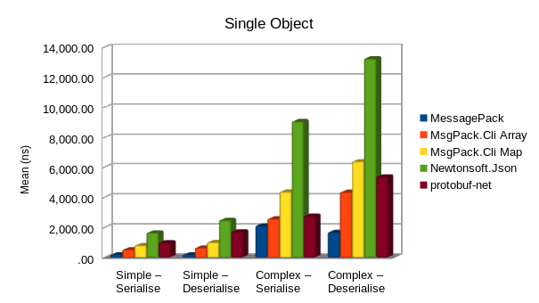
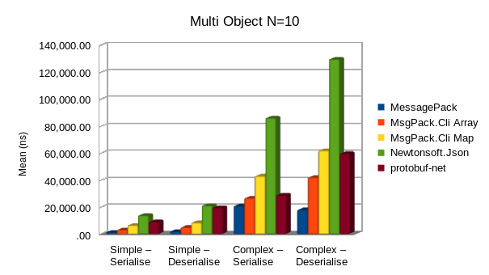
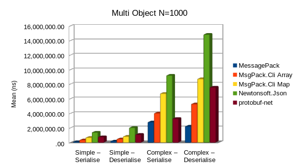
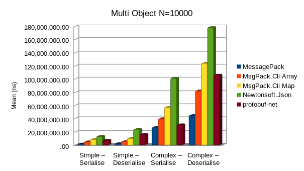

Benchmarks for various .Net serialisers

## Result 2019-01-26

Testing the latest current version of the following serialisers:

- [MessagePack](https://github.com/neuecc/MessagePack-CSharp) 1.7.3.4
- [MsgPack.Cli](https://github.com/msgpack/msgpack-cli) 1.0.0
  - **Note**: This version appears to have a major performance regression when serialising.
    This test should really be re-run with a 0.9.x version to verify
- [Newtonsoft.Json](https://github.com/JamesNK/Newtonsoft.Json) 12.0.1
- [protobuf-net](https://github.com/mgravell/protobuf-net) 2.4.0

Message size in bytes:

| Serialiser                | Simple | Complex | Simple (10) | Complex (10) | Simple (10000) | Complex (10000) |
| ------------------------- | ------:| -------:| -----------:| ------------:| --------------:| ---------------:|
| MessagePackContractless   | 45 | 373 | 456 | 3,841 | 469,649 | 3,934,643 |
| MsgPackCliArray           | 45 | 330 | 461 | 3,381 | 469,769 | 3,474,645 |
| MsgPackCliMap             | 61 | 424 | 621 | 4,321 | 629,769 | 4,414,645 |
| NewtonsoftJson            | 75 | 520 | 762 | 5,380 | 781,367 | 5,603,728 |
| ProtobufNet               | 46 | 343 | 475 | 3,538 | 484,845 | 3,647,482 |
